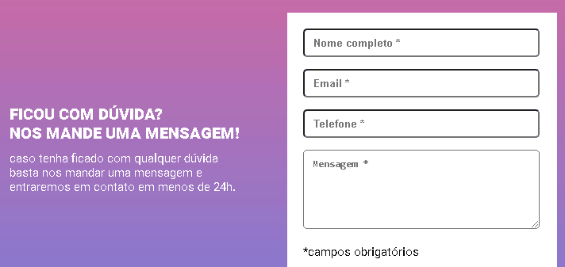

# projeto-teste
meu projeto visa praticar validaçao de formulario com JavaScript puro 

[]

## tecnologias utilizadas 

-html 

-css 

-js 

## como utilizar
 
1 - clone pro o projeto
```
 git clone <url>
 
 ```

 2 -acesse a pasta do projeto
 ```
 cd repositorio-com-readme

